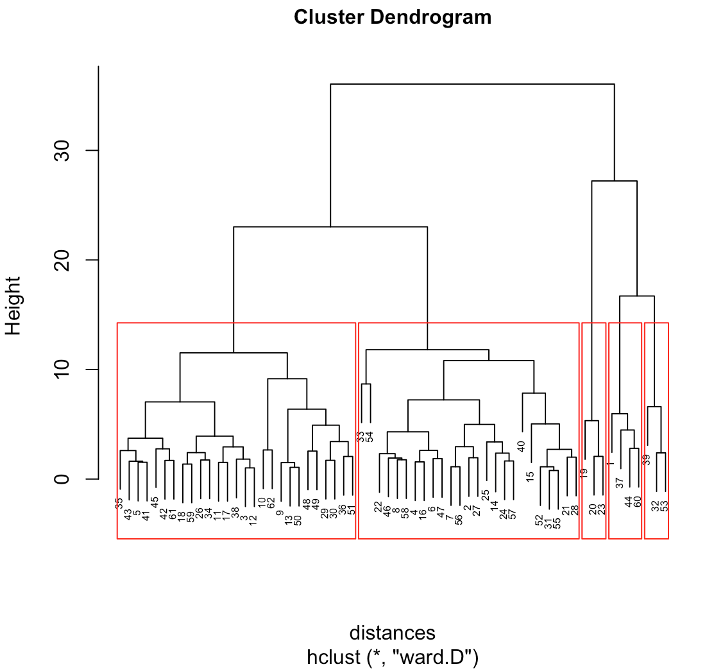

# clustering
Collection of methods to assist in performing/analyzing clustering techniques.

## Visualization

Methods to produce, for example:

Dendograms:

Heatmaps that show scaled clustering averages:

