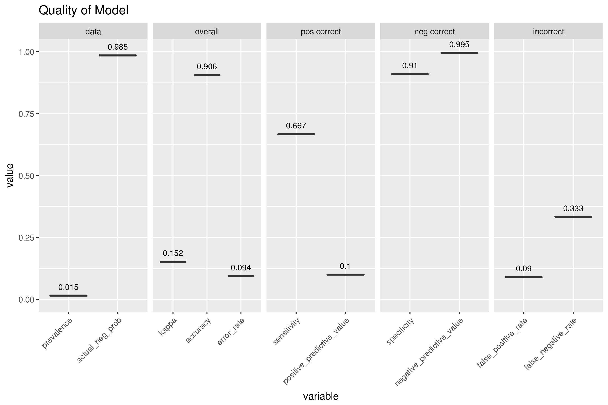
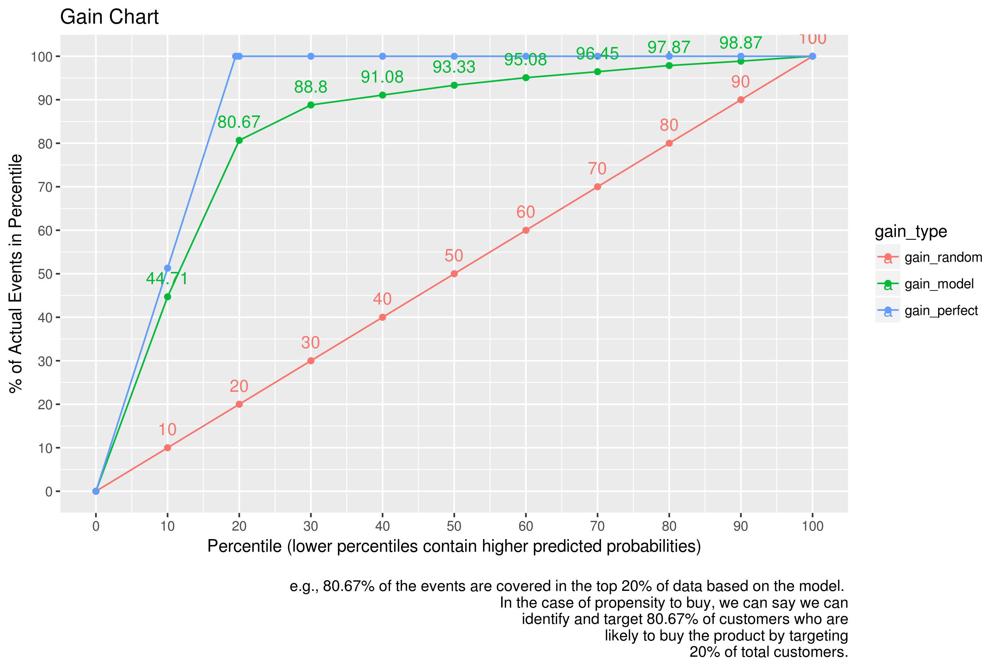
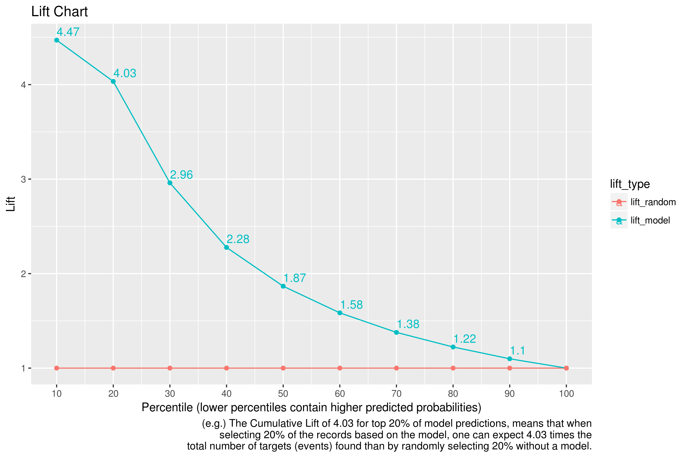
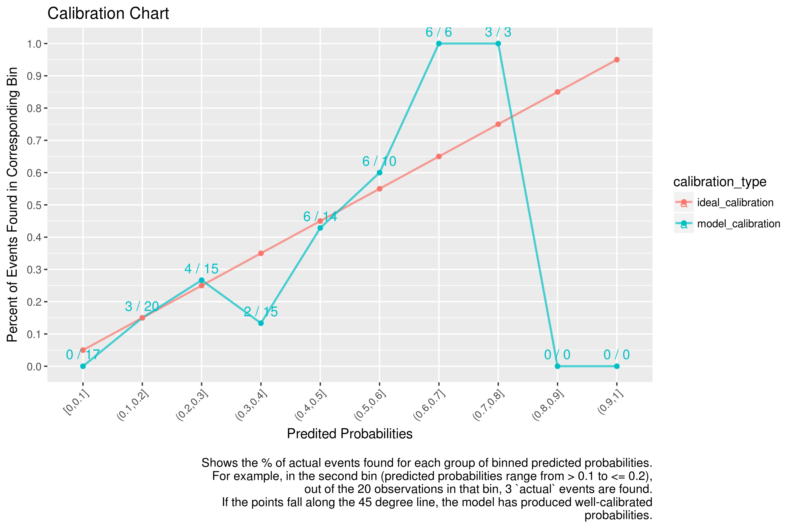
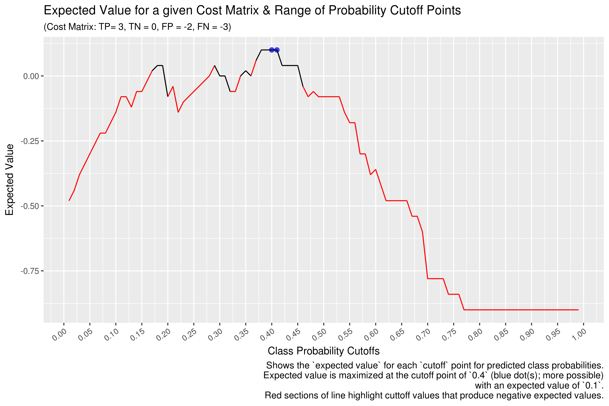

# General Helper Functions

## basic_stats.R

- general stats helper functions

```R
create_percentile_matrix <- function(list_of_datasets, row_names, percentiles=c(0, 0.025, 0.05, 0.10, 0.25, 0.50, 0.75, 0.90, 0.95, 0.975, 1), round_by=1)
```

- note that if some data has subsets (e.g. comparing all users to a subset of users) for the subset data, you only want to pass in the
- subset (as opposed to relying on NA data). The reason is that, for example, the '% data above/below outlier threshold' needs to know
- the total lenght of only the subset, in order to accurately calculate

```R
tabulate_logical <- function(logical_data_frame)
```

- takes a dataframe that contains logical columns and returns a dataframe that contains percent information for each

```R
explore_numeric <- function(numeric_vector)
```
- takes a numeric vector and prints out basic/exploratory stats

## correlations.R

```R
get_correlations <- function(data_frame, corr_threshold=0.7, p_value_threshold=0.1, type='pearson')
```

- takes a data-frame, subsets the numeric columns, and returns a matrix of correlations with `NA`s where
	- absolute value of correlation value is <= `corr_threshold`
	- corresponding p_value is <= `p_value_threshold`
- can pass in correalation `type`
	- specifies the type of correlations to compute. `Spearman` correlations are the `Pearson` (default) linear correlations computed on the ranks of non-missing elements, using midranks for ties.
	- If you want to explore your data it is best to compute both, since the relation between the `Spearman (S)` and `Pearson (P)` correlations will give some information. Briefly, `S` is computed on ranks and so depicts monotonic relationships while `P` is on true values and depicts linear relationships. [stats.stackexchange.com](http://stats.stackexchange.com/questions/8071/how-to-choose-between-pearson-and-spearman-correlation)
- so if `threshold` is 0.9, the resulting matrix will only show correlations >=0.9 and <= -0.9. All other values will show `NA`

```R
plot_correlations <- function(data_frame)
```

- plots correlations on x/y axis using colors/sizes to visualize
- example:


## dates.R

```R
add_date_columns <- function(data_frame, date_column)
```

- takes a dataframe with date column and adds a column for `year`, `month`, `week number`, `weekday`, `day of year`, and `day of month`
- `date_column` is string name of date column

## model_measurements.R

- provides a list of functions that help assess the quality of various models
	- e.g. https://en.wikipedia.org/wiki/Sensitivity_and_specificity

```R
confusion_list <- function(true_pos, true_neg, false_pos, false_neg)
```

- wrapper for `confusion matrix` (but matrix in R is a specific type, so I use 'list')
- `conf_list` is list returned by `confusion_list` function

```R
confusion_list_from_confusion <- function(confusion_matrix)
```

- takes a confusion matrix (`confusion_matrix`) with predictions as columns and actuals as rows (negatives first, positives second) and returns a `conf_list` list (from `confusion_list` function)
- confusion matrix in following format

|                  | Predicted Negative | Predicted Positive |
| ---------------- | ------------------ | ------------------ |
| Actual Negative  | True Negative      | False Positive     |
| Actual Positive  | False Negative     | True Positive      |

- a `positive` can be thought of as a `detection`, while a `negative` is a `non-detection`
	- e.g. logistic regression predicting (detecting) fraud. A positive would be a predicted or actual fraud occurance. So a `false positive` would be a case when we *predict* a positive (i.e. fraud), but the *actual* case was not fraud.
- `confusion_matrix` can be constructed with `table(actuals, predictions)`

```R
sensitivity <- function(conf_list)
```

- a.k.a `true positive rate`
- measures the proportion of positive examples that were correctly classified
- number of positives predicted correctly (true positives) out of total number of positives
- `conf_list` is list returned by `confusion_list` function

> NOTE:
>
> `sensitivity` a.k.a `true positive rate` a.k.a `recall`, `positive_predictive_value` a.k.a `precision` a.k.a `Posterior Probability` of Bayes theorem, and `prevalence` can all be confused against each other.
>
> `prevalence` is number of actual positive _cases_ (`true positives` + `false negatives`) out of *total population*
> - e.g. how many people actually have the disease out of the total population
>
> `sensitivity` is number of correct positive predictions (`true positives`) out of all *_actual_* positives (`true positives` + `false negatives`)
> - e.g. correct positive tests out of everyone that _actually_ has the disease.
>
> `positive_predictive_value` is number of correct positive predictions (`true positives`) out of all *_predicted_* positives (`true positives` + `false positives`)
> - e.g. correct positive tests out of everyone that we _predicted_ has the disease.
> - e.g. when a model predicts the positive class, how often is it correct?
> actually, same as posterior probability of Bayes theorem `P(D|T)` (see [probability/README.md](../probability/README.md))
>	- the probability of having a Disease (`D`) given a positive test result (`T`) is the same as saying `P(actually being positive | positive result)` i.e positives predicted correctly out of total positive predictions
>
> |                  | Predicted Negative | Predicted Positive |
> | ---------------- | ------------------ | ------------------ |
> | Actual Negative  | True Negative = 905| False Positive=10  |
> | Actual Positive  | False Negative = 5 | True Positive=80  |
>
> `prevalence` == `TP` + `FN` / `TOTAL` == 80 + 5 / 1000 == `0.085` (e.g. `8.5%` of population has disease)
>
> `positive_predictive_value` i.e. `precision` == `TP` / (`TP` + `FP`) == 80 / (80 + 10) == `0.8888889` (e.g. P(D|T) == `89%; if you get a positive test result back, you have an `89%` chance of actually having the disease)
>
> `sensitivity` i.e. `recall` == `TP` / (`TP` + `FN`) == 80 / (80 + 5) == `0.9411765` (e.g. `94%` of people who have the disease will be tested positive)
>
> often people who receive a positive test result mistake sensitivity with positive predictive value (which is often lower). (see [probability/README.md](../probability/README.md) for more info on relationship)

```R
specificity <- function(conf_list)
```

- a.k.a `true negative rate`
- number of negatives predicted correctly (true negatives) out of total number of negatives
- `conf_list` is list returned by `confusion_list` function

```R
false_negative_rate <- function(conf_list)
```

- number of negatives predicted that were actually positive, out of total number of positives
- `conf_list` is list returned by `confusion_list` function

```R
false_positive_rate <- function(conf_list)
```

- number of positives predicted that were actually negative out of total number of negatives
- `conf_list` is list returned by `confusion_list` function

```R
accuracy <- function(conf_list)
```

- sometimes called the `success rate`
- number of correct predictions out of total number of observations
- `conf_list` is list returned by `confusion_list` function

```R
error_rate <- function(conf_list)
```

- the error rate is `1 - accuracy`
- number of incorrect predictions out of total number of observations
- however, because not all errors are treated the same (e.g. false negative for cancer detection is worse than false positive), this number shouldn't be looked at alone.
- `conf_list` is list returned by `confusion_list` function

```R
kappa <- function(conf_list)
```

- `kappa` statistic adjusts accuracy by accounting for the possibility of a correct prediction by chance alone.
	- this is especially important for datasets with a severe class imbalance, because a classifier can obtain high accuracy simply by always guessing the most frequent class.
- common interpretation:
	- `Poor` Agreement: `0.0 to 0.2`
	- `Fair` Agreement: `0.2 to 0.4`
	- `Moderate` Agreement: `0.4 to 0.6`
	- `Good` Agreement: `0.6 to 0.8`
	- `Very Good` Agreement: `0.8 to 1.0`
- _source: Machine Learning with R (2nd Ed) - Lantz - pg 323-326_

```R
positive_predictive_value <- function(conf_list)
```

- number of positives predicted correctly out of total number positive _predictions_
- in other words, when model predicts the positive class, how often is it correct?
- actually, same as posterior probability of Bayes Rule `P(D|T)`
	- the probability of having a Disease (`D`) given a positive test result (`T`) is the same as saying `P(actually being positive | positive result)` i.e positives predicted correctly out of total positive predictions
- also known as `precision`
- `conf_list` is list returned by `confusion_list` function

```R
negative_predictive_value <- function(conf_list)
```

- number of negatives predicted correctly out of total number of negative _predictions_
- in other words, when model predicts the negative class, how often is it correct?
- `conf_list` is list returned by `confusion_list` function

```R
recall <- function(conf_list)
```

- same as `sensitivity`
- slightly different interpretation.
- a model with high recall captures a large portion of the positive examples, meaning that it has wide breadth.

```R
prevalence <- function(conf_list)
```

- actual positives out of total population.
	- e.g. prevalence of a disease
	- same as `actual positive probability`

```R
quality_of_model <- function(conf_list)
```

- `conf_list` is list returned by `confusion_list` function
- returns a dataframe that contains the following columns
	- `kappa`
	- `accuracy`
	- `error_rate`
	- `sensitivity`
	- `specificity`
	- `false_positive_rate`
	- `false_negative_rate`
	- `positive_predictive_value`
	- `negative_predictive_value`
	- `recall`
	- `prevalence`
	- `actual_pos_prob` (total actual positives / total observations)
	- `actual_neg_prob` (total actual negatives / total observations)
	- `total_observations`

```R
visualize_quality_of_model <- function(conf_list)
```

- takes a `conf_list` and returns a `ggplot` of various measurements from `quality_of_model` data.frame



```R
logistics_regression_coefficients <- function(b, b1, x1, b2=0, x2=0, b3=0, x3=0, b4=0, x4=0, b5=0, x5=0)
```

```R
logistic_response_function <- function(b, b1, x1, b2=0, x2=0, b3=0, x3=0, b4=0, x4=0, b5=0, x5=0)
```

```R
odds <- function(b, b1, x1, b2=0, x2=0, b3=0, x3=0, b4=0, x4=0, b5=0, x5=0)
```

```R
logit <- function(b, b1, x1, b2=0, x2=0, b3=0, x3=0, b4=0, x4=0, b5=0, x5=0)
```

```R
gain_lift_table <- function(actual_observations, predicted_probabilities = NULL, number_of_bins = 10, target_positive_class = 'positive')
```

- creates a gain/lift table based on http://www.listendata.com/2014/08/excel-template-gain-and-lift-charts.html
	- if `predicted_probabilities` is not passed in, then `actual_observations` needs to be ordered by the corresponding predicted probabilities in descending order.

- according to the [reference above](http://www.listendata.com/2014/08/excel-template-gain-and-lift-charts.html):

> **Gain** at a given decile level is the ratio of cumulative number of targets (events) up to that decile to the total number of targets (events) in the entire data set.

> Interpretation: % of targets (events) covered at a given decile level. For example,  80% of targets covered in top 20% of data based on model. In the case of propensity to buy model, we can say we can identify and target 80% of customers who are likely to buy the product by just sending email to 20% of total customers.

> **Lift** measures how much better one can expect to do with the predictive model comparing without a model. It is the ratio of gain % to the random expectation % at a given decile level. The random expectation at the xth decile is x%.

> Interpretation: The Cumumative Lift of 4.03 for top two deciles, means that when selecting 20% of the records based on the model, one can expect 4.03 times the total number of targets (events) found by randomly selecting 20%-of-file without a model.

```R
gain_lift_charts <- function(gain_lift_table, round_by = 2)
```

- this function returns a list of two ggplot objects, the first containing the `gain` chart, and the second contining the `lift` chart.
- `gl_table` takes a dataframe returned by the `gain_lift_table()` function.

Example Gain Chart: 



Example Lift Chart: 



```R
calibration_table <- function(actual_observations, predicted_probabilities, target_positive_class = 'positive')
```

- a calibration chart/plot/table "shows some measure of the observed probability of an event versus the predicted class probability." [Applied Predictive Modeling By Max Kuhn and Kjell Johnson, pg 249](http://appliedpredictivemodeling.com/)

```R
calibration_chart <- function(cal_table, round_by = 2)
```

- this function returns a ggplot object showing a calibration chart based on [Applied Predictive Modeling By Max Kuhn and Kjell Johnson, pg 249](http://appliedpredictivemodeling.com/)
- `cal_table` takes a dataframe returned by the `gain_lift_table()` function.


Example Calibration Chart: 



```R
expected_value_confusion_matrix <- function(confusion_matrix, gain_cost_matrix)
```

- multiplies the cell probabilities (i.e. false positive occurance rate (`FP / total observations`); different from traiditional false positive rate) against the expected value of a each confusion outcome for an 'expected value'

```R
expected_value_with_priors_confusion_matrix <- function(confusion_matrix, gain_cost_matrix, class_prior_positive_rate)
```

- uses basic rule of probability that `p(x, y) = p(y) * p(x | y)` which we can use to introduce the conept of `class priors`. 

```R
expected_value_chart <- function(predicted_probabilities_positive, actual_outcomes, gain_cost_matrix)
```

- this function returns a ggplot object showing `expected value` for each `cutoff` point for the predicted class probabilities (positive class)
- `predicted_probabilities_positive` is a vector of probabilities
- `actual_outcomes` is a vector of logicals, `TRUE` for positive classes and `FALSE` for negative classes.
- `gain_cost_matrix` follows the same structure as `confusion_list_from_confusion` function above 


Example Expected Value Chart: 



```R
check_data <- function(dataset, sample_to_predictor_ratio_threshold = NULL, class_to_predictor_ratio_threshold = NULL, class_names = NULL)
```

- checks the `dataset` for the following conditions
	- the dataset should have a `target` column, representing the prediction/dependent variable.
- `sample_to_predictor_ratio_threshold` ratio representing the minimum amount of sample-to-predictors to allow.
	- for example, if the ratio is set to `10`, and there are `5` predictors, there needs to be at least `50` rows/samples
- `class_to_predictor_ratio_threshold` ratio representing the minimum amount of sample-to-predictors, PER CLASS, to allow.
	- for example, if the ratio is set to `10`, and there are `5` predictors, there needs to be at least `50` rows/samples in each class.
- `class_names` should be a vector of the class names in the `dataset` `target` variable. 

## modification.R

```R
add_dummy_columns <- function(data_frame, column_name, sort_levels=FALSE)
```

- takes a dataframe and for the specified (string) column `column_name`, creates x-1 dummy columns where x is the number of levels/factors of `column_name`
- `sort_levels` TRUE indicates that the order of columns should depend on `sort` method of levels.
- `use_levels` TRUE indicates that the order of the columns should depend on the levels of the column (requires a factor variable).
	- the last level will be the variable left out.
- `custom_levels` allows you to specify custom ordering of levels by passing in a character vector

```R
add_matrix_totals <- function(contingency_table)
```
- takes a matrix (i.e. in contingency table format) and adds row and column totals.

```R
get_scaled_dataset <- function(data_frame, named_column)
```

- scales data to `z-scores` so they can be compared against each other (e.g. in clustering)
- `named_column` is name of column that is row_identifier that tells the function to ignore that column for scaling

```R
get_numeric_dataset <- function(data_frame, named_column=NULL)
```

- returns the numeric columns, as well as the (optional) column `named_column` (most likely a row unique identifier)

```R
get_logical_dataset <- function(data_frame, named_column=NULL)
```

- returns the logical columns, as well as the (optional) column `named_column` (most likely a row unique identifier)

```R
get_numeric_logical_dataset <- function(data_frame, named_column=NULL)
```

- returns the numeric and logical columns, as well as the column `named_column` (most likely a row unique identifier)

```R
normalize <- function(x)
```

- min/max normalization that transforms `x` such that all of the values of `x` fall in a range between `0` and `1`
- `x` is a numeric vector
- WARNING: extreme values will make the data compress towards the center, consider `z-score standardization`

```R
vector_match_regex <- function(the_vector, pattern_to_find, pattern_to_extract=NULL, substitue_find_with=NULL)
```

- returns a list of matched items by regex as well as the corresponding indexes that match
- can pass in a substitute string if the matched items from `pattern_to_find` should be substituted with a string
- sometimes the `pattern_to_extract` will be different from the `pattern_to_find`, so set variables accordingly; if `pattern_to_extract` is not set, it will default to `pattern_to_find`
- returns a list of two items 1) `indexes_of_match` and `matches`

## outliers.R

```R
calculate_outlier_thresholds <- function(vect)
```

- calculates outlier thresholds based on Quantil 1,3 +- 1.5 IQR
- returns a named vector with `lower` `upper` labels

```R
remove_outliers <- function(vect)
```

- changes any outliers in vector `vect` to NA, based on `calculate_outlier_thresholds` function

```R
which_outliers <- function(vect)
```

- returns the indexes of outliers from a vector `vect`, based on `calculate_outlier_thresholds` function

## utlities

```R
stopif <- function(condition, message, call=FALSE)
```

- calls base `stop` function if `condition` is true with `message`
- `call` is passed into `call.` variable of base `stop` function

```R
is.nullNaEmpty <- function(...)
```

- tests each element in `...` (which can be vector, list, single element, or combination) for NULL, NA, or Empty (i.e. ==\'\')

```R
lazy_load <- function(path, object, create_data, dataset_function)
```

- this method is used for creating/caching large datasets via manipulation methods (e.g. dplyr), that take a substantial amount of time to run
- the method either creates the dataset from scratch (via `dataset_function` function), loads the stored dataset from an .Rda file, or returns the existing dataset if it is already populated.
- `path` is path to Rda file
- `object` is the object you want to populate
- `create_data` is a flag to specify whether or not to create the dataset specified by `dataset_function`
- `dataset_function` should return a dataset
- if `create_data` is `TRUE`, then the `dataset_function` will be executed
- otherwise, if the `object` exists and is not null, it will simply be returned.
- if neither condition is true, then the dataset will be loaded from the Rda file specified from `path`
