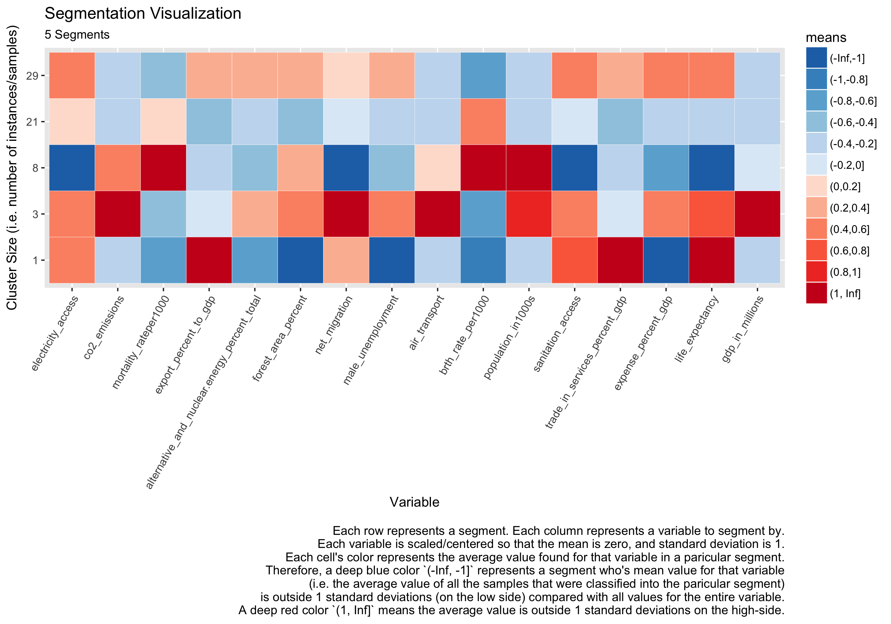
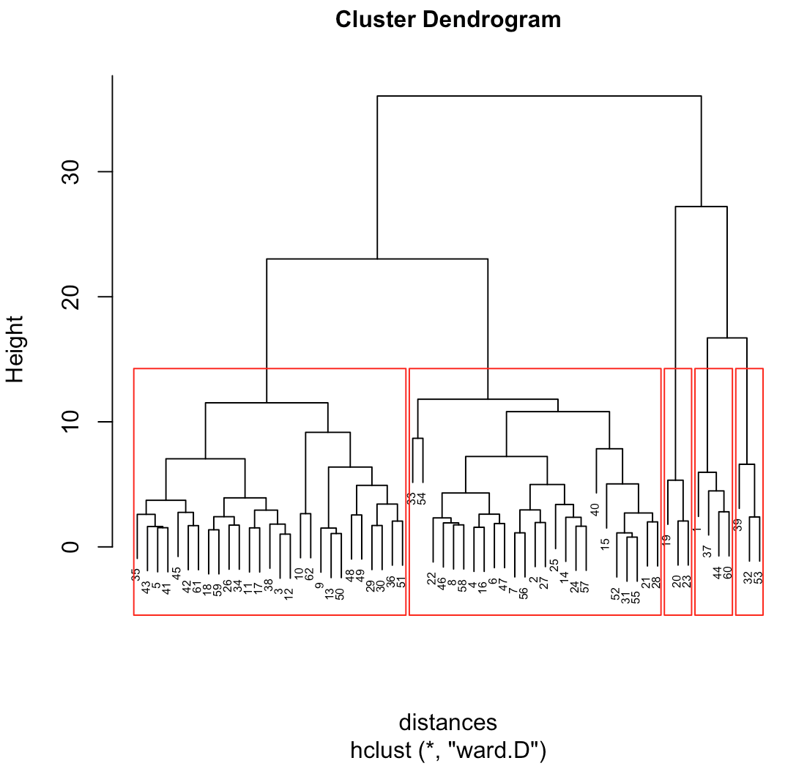

# machine_learning_wrappers

- provides implementations/wrappers/customizations for various machine learning algorithms I have used, and is also used to serve as an example (i.e. reminder) for future usages.

## c50.R

```R
c5.0_cost_tuning <- function(	training_data,
								target_positive_class,
								target_negative_class,
								param_grid,
								k_folds = 5,
								min_branches = 4,
								max_branches = 40,
								seed = 1,
								criteria_weights = c(	kappa = 2,
														sensitivity = 1,
														positive_predictive_value = 1))
```

- provides a wrapper for C5.0
- the primary benefit is that it tunes across different error `costs` (e.g. false positive, false negative) and allows the user to place weights on the criteria. 
	- for example, if inference and finding patters are more important than prediction, then perhaps `positive predictive value` is more important than `sensitivity`. In other words we are willing to miss some potential patterns (`sensitivity`) in order to ensure that the (positive) patterns that we do find are highly predictive (i.e. `positive predictive poower`).
- because the original intent is weighted towards inference, the `trials` parameter in the parent `C5.0` function is not tuned on, because multiple 'voting' trees makes inference very difficult.

## clustering
Collection of methods to assist in performing/analyzing clustering techniques.

### Visualization

```R
cluster_heatmap <- function(results_df, start_stop=1)
```

- takes a dataframe (`results_df` returned by an `xxx_cluster_analysis` function) with each cluster as row and all cluster variables as columns, cells representing cluster/variable means (or medians,etc.)
- `start_stop` is absolute number of min/max scale (z-score) value

Example of heatmap, which shows scaled (z-score) clustering averages:


```R
save_kmeans_heatmaps <- function(kmeans_results, folder, subscript='')
```

- helper method to save all the cluster results to heatmaps from `kmeans_cluster_analysis`
- takes `kmeans_results` (list returned by `kmeans_cluster_analysis` function) and, for each kmeans result, creates and saves a heatmap to `folder` in the form of `./%1/kmeans%2_%3_clusters_%4.png`, where
  - `%1` == `folder`
  - `%2` == `subscript`
  - `%3` == # of clusters
  - `%4` == date/time

```R
save_hierarchical_heatmaps <- function(hierarchical_results, folder, subscript='')
```

- same as `save_kmeans_heatmaps` above

```R
save_hierarchical_dendogram <-function(data_frame, named_column, ideal_cluster_size=NULL, path='./dendogram.png')
```

- takes a data_frame (same as `hierarchical_cluster_analysis`) and generates a dendogram showing ideal number of clusters
- `merge_column` represents a **unique row id** (e.g. customer_id, that would be ignored by clustering algorithm, but is used to merge data back in)
- if `ideal_cluster_size` was previously calculated, that can be passes as a parameter, otherwise it will be calculated

Example of dendogram, which shows the calculated ideal number of clusters:


### Clustering Algorithms

#### hierarchical

```R
hierarchical_cluster_analysis <- function(data_frame, merge_column, num_clusters=5, plus_minus=3, seed_num=123)
```

- takes a dataframe and runs hierarchical cluster analysis using all numeric and logical (TRUE/FALSE) columns
-- `merge_column` represents a **unique row id** (e.g. customer_id, that would be ignored by clustering algorithm, but is used to merge data back in)
- `num_clusters` and `plus_minus` are used to indicate the number of clusters that should be calculated
    - [num_clusters - plus_minus, num_clusters + plus_minus] default: (5-3,5+3) == (2,8)
    - so a cluster analysis will be run for cluster size of 2, 3, ..., 7, 8
- duplicate values are not allowed with this implementation because there should be a column that represents a unique id

```R
hierarchical_merge_cluster_data <- function(original_data_frame, merge_column, num_clusters=5, plus_minus=3)
```

- takes the same parameters as `hierarchical_cluster_analysis`
- unfortunately, because of how the hierarchical cluster analysis is calculated and returned, this method doesn't take the results of the analysis, but actually reruns the analysis

```R
hierarchical_get_clusters_mean_st_dev <- function(hierarchical_results)
```

- takes a `hierarchical_results` list and returns a vector containing the mean standard deviation within each cluster analysis.
- then you would use `which(cluster_mean_standard_deviations == min(cluster_mean_standard_deviations))` to get the cluster analysis with the least variability within each cluster

```R
hierarchical_get_clusters_means <- function(hierarchical_results)
```

- for each cluster analysis in `hierarchical_results` list, for each cluster within each analysis, gets the mean (in z-score) of each column

```R
hierarchical_nrow <- function(hierarchical_results)
```

- for each cluster analysis in `hierarchical_results` list, returns the number of data items in each cluster (cluster corresponds to index number)

#### kmeans

```R
kmeans_cluster_analysis <- function(data_frame, merge_column, num_clusters=5, plus_minus=3, seed_num=123)
```

- takes a dataframe and runs kmeans cluster analysis using all numeric and logical (TRUE/FALSE) columns
- `merge_column` represents a **unique row id** (e.g. customer_id, that would be ignored by clustering algorithm, but is used to merge data back in)
- `num_clusters` and `plus_minus` are used to indicate the number of clusters that should be calculated
    - [num_clusters - plus_minus, num_clusters + plus_minus] default: (5-3,5+3) == (2,8)
    - so a cluster analysis will be run for cluster size of 2, 3, ..., 7, 8

```R
kmeans_merge_cluster_data <- function(kmeans_results, original_data_frame, merge_column, num_clusters=5, plus_minus=3)
```

- takes a `kmeans_results` (list returned by `kmeans_cluster_analysis` function) and merges clusters with `original_data_frame`
- merge_column is the column that represents the unique row identifier

```R
kmeans_merge_cluster_data2 <- function(kmeans_results, any_dataframe, merge_column, num_clusters, plus_minus)
```

- takes a `kmeans_results` (list returned by `kmeans_cluster_analysis` function) and merges clusters with `any_dataframe`
- merge_column is the column that represents the unique row identifier

```R
kmeans_BSS_TSS <- function(kmeans_results)
```

- takes a `kmeans_results` (list returned by `kmeans_cluster_analysis` function)
- returns a vector with the BSS/TSS ratio for each item in kmeans_results
- Ideally you want a clustering that has the properties of internal cohesion and external separation, i.e. the BSS/TSS ratio should approach 1. (http://stats.stackexchange.com/questions/82776/what-does-total-ss-and-between-ss-mean-in-k-means-clustering)

#### general

```R
get_ideal_number_of_clusters <- function(data_frame, named_column)
```

- calculates the idea number of clusters
- takes same type of dataframe as `hierarchical_cluster_analysis`

```R
get_ideal_number_of_clusters_nb <- function(data_frame, named_column)
```

- calculates the idea number of clusters
- uses the `NbClust` cluster function ([CRAN documentation](https://cran.r-project.org/web/packages/NbClust/NbClust.pdf))

## Note
NA values are automatically omitted with these clustering methods, so be conscious about cleaning your data;
- for example, pre-clustering your data such (e.g. could split up data between paid v. non-paying customers if you have a lot of data with NAs for non-paying customers)
- or converting columns with NAs (such as a time column `time_to_paid`) to a TRUE/FASLE column (e.g. `is_paying`)

## trees

TBD
