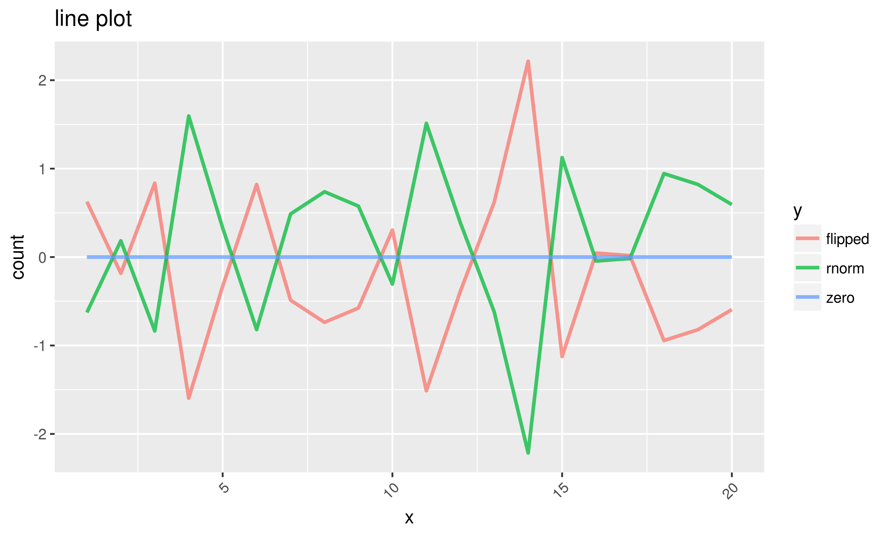

# Output

## markdown.R
- helper functions that format text as markdown
- these functions are tailored towards GitHub markdown (https://guides.github.com/features/mastering-markdown/) so that the output of various analysis can be read directly via GitHub
- the defualt `postfix` value for most functions is *not* to add newlines. This is primarily used in `logger.R` which automatically formats trailing spaces or newlines
- example markdown file (generated from [test_markdown.R](../tests/test_markdown.R)): [example_markdown.md](./example_markdown.md)

```R
h1 <- function(text, postfix='')
```
- header 1

```R
h2 <- function(text, postfix='')
```
- header 2

```R
h3 <- function(text, postfix='')
```
- header 3

```R
h4 <- function(text, postfix='')
```
- header 4

```R
bold <- function(text, postfix='')
```
- bold

```R
ital <- function(text, postfix='')
```
- italics

```R
strike <- function(text, postfix='')
```
- strike-through

```R
code <- function(text, postfix='')
```
- inline code

```R
codeb <- function(text, postfix='', syntax='')
```
- code block

```R
codebc <- function(text, postfix='', syntax='')
```
- code block that calls print_c (which captures the output of `print(text)` and it returns it as a variable)

```R
blockq <- function(text, postfix='')
```
- block quote

```R
urlm <- function(text, url, postfix='')
```
- url

```R
image <- function(text, url, postfix='')
```
- image

```R
table_matrix <- function(a_matrix, title=NULL, row_header='Row', title_format=h1, title_postfix='\n', postfix='\n')
```
- takes a matrix and converts it to a markdown table


## logger. R
- setting `logger.output_file` to NULL allows logging to be printed to console. Setting it to file path allows outputing to file.
	- e.g. you can do `logger.set_output(NULL)` and then manually use sink e.g. `sink(file='./results/non_try_analysis_results.txt', append=FALSE)`

```R
logger.set_output <- function(output_file)
```

```R
logger.set_threshold <- function(threshold = logger.DEBUG)
```

```R
logger.set_use_markdown <- function(use_bool)
```

```R
logger.reset_log_file <- function()
```

```R
log.DEBUG <- function(message, prefix='', postfix='\n\n', should_log=TRUE)
```

```R
log.INFO <- function(message, prefix='', postfix='\n\n', should_log=TRUE)
```

```R
log.WARNING <- function(message, prefix='', postfix='\n\n', should_log=TRUE)
```

```R
log.ERROR <- function(message, prefix='', postfix='\n\n', should_log=TRUE)
```

```R
log.NOTE <- function(message, prefix='', postfix='\n\n', should_log=TRUE)
```

```R
log_helper <- function(log_level, log_name, message, prefix, postfix, should_log=TRUE)
```

## output.R

```R
print_c <- function(something, collapse=TRUE, trim=TRUE)
```
- captures the output of `print(something)` and it returns it as a variable rather than outputting (can then be used with markdown, logging, etc.)
- `collapse` variable is an optional character string to separate the results; or when used with character vectors to correct format the output of `print(something)`
- `trim` removes leading and trailing whitespace

## plots.R

```R
line_plot_wide_data <- function(df_wide, title='line plot', x_label='x', y_label='count')
```
- takes a wide dataset with column x (representing an index row which will be in x-axis) and all additional columns as summation/count rows; plots as line graph x as x-axis, values in remaining columns as y-axis, and each additional column (from x) as a single line
- `save_file` is the path/name of the file/plot to save. If value is set to `NULL` (default), then plot will not be saved to a file.
- for example, given the following dataframe

```
set.seed(1)
normal_distribution = rnorm(n=20)
df_wide = data.frame(x=1:20, rnorm=normal_distribution, flipped=normal_distribution * -1, zero=rep(0,20))
```

- this plot is generated



```R
line_plot_long_data <- function(df_long, title='line plot', x_label='x', y_label='count')
```
- takes long data and plots a line graph
- `save_file` is the path/name of the file/plot to save. If value is set to `NULL` (default), then plot will not be saved to a file.
- the dataset is in the format of a dataframe like the one below

```
set.seed(1)
normal_distribution = rnorm(n=20)
df_wide = data.frame(x=1:20, rnorm=normal_distribution, flipped=normal_distribution * -1, zero=rep(0,20))df_long = gather(df_wide, group, count, -x)
```

```R
heat_map_wide_data <- function(df_wide, title='heat map', x_label='x', y_label='count', scale_label='scale', y_factor_order=NULL, save_file=NULL)
```
- graphs a heatmap of df that has wide data (e.g. hours as rows, days as columns, and count of website visitors as values)
- `y_factor_order` is variable that describes the order of y level data (e.g. days of week), if such an order exists.
- see [test_plots.R](../tests/test_plots.R)) for example, which produces the following heatmap 


```R
heat_map_long_data <- function(df_long, title='heat map', x_label='x', y_label='count', scale_label='scale', save_file=NULL)
```
- same as `heat_map_wide_data`, but takes data in long format (e.g. rows that make up hour/day combinations).
- see [test_plots.R](../tests/test_plots.R)) for example, simply call `gather_data` on df_wide to see dataset.
