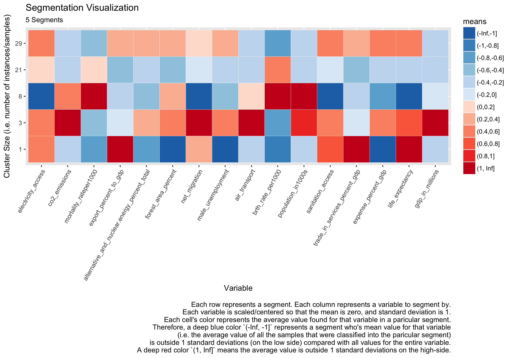

generated by  [test_markdown.R](../tests/test_markdown.R)

# header 1
text
## header 2
text
### header 3
text
this is some **bold text** and this is some _italicized text_ and this is some ~~strike-through text~~ and this some `inline code`

```
and here is some
block code
```

```javascript
document.getElementById('demo').style.fontSize='35px'
```

> this is a blockquote

### example table from matrix
Row|0%|2.5%|5%|10%|25%|50%|75%|90%|95%|97.5%|100%|outlier threshold lower|outlier threshold upper|% data below threshold|% data above threshold
---|---|---|---|---|---|---|---|---|---|---|---|---|---|---|---
test1|0.0|2.5|5.0|10.0|25.0|50.0|75.0|90.0|95.0|97.5|100.0|-50.0|150.0|0.0|0.0
test2|0.0|2.5|5.0|10.0|25.0|50.0|75.0|90.0|95.0|97.5|100.0|-50.0|150.0|0.0|0.0

and blow is a code block using `codebc` which calls `print_c` in [output.R](./output.R) to preserve `print()`-like formatting:
```
       0%         2.5%           5%         10%          25%          50%    
 Min.   :0   Min.   :2.5   Min.   :5   Min.   :10   Min.   :25   Min.   :50  
 1st Qu.:0   1st Qu.:2.5   1st Qu.:5   1st Qu.:10   1st Qu.:25   1st Qu.:50  
 Median :0   Median :2.5   Median :5   Median :10   Median :25   Median :50  
 Mean   :0   Mean   :2.5   Mean   :5   Mean   :10   Mean   :25   Mean   :50  
 3rd Qu.:0   3rd Qu.:2.5   3rd Qu.:5   3rd Qu.:10   3rd Qu.:25   3rd Qu.:50  
 Max.   :0   Max.   :2.5   Max.   :5   Max.   :10   Max.   :25   Max.   :50  
      75%          90%          95%         97.5%           100%    
 Min.   :75   Min.   :90   Min.   :95   Min.   :97.5   Min.   :100  
 1st Qu.:75   1st Qu.:90   1st Qu.:95   1st Qu.:97.5   1st Qu.:100  
 Median :75   Median :90   Median :95   Median :97.5   Median :100  
 Mean   :75   Mean   :90   Mean   :95   Mean   :97.5   Mean   :100  
 3rd Qu.:75   3rd Qu.:90   3rd Qu.:95   3rd Qu.:97.5   3rd Qu.:100  
 Max.   :75   Max.   :90   Max.   :95   Max.   :97.5   Max.   :100  
 outlier threshold lower outlier threshold upper % data below threshold
 Min.   :-50             Min.   :150             Min.   :0             
 1st Qu.:-50             1st Qu.:150             1st Qu.:0             
 Median :-50             Median :150             Median :0             
 Mean   :-50             Mean   :150             Mean   :0             
 3rd Qu.:-50             3rd Qu.:150             3rd Qu.:0             
 Max.   :-50             Max.   :150             Max.   :0             
 % data above threshold
 Min.   :0             
 1st Qu.:0             
 Median :0             
 Mean   :0             
 3rd Qu.:0             
 Max.   :0             
```

and here is a [url](../README.md) to the readme file

and here is an image:



the end :)
